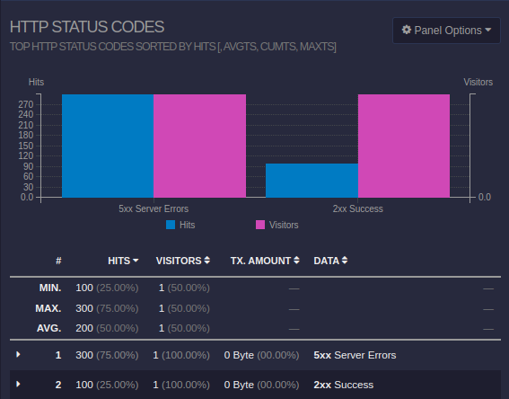

# Nginx Proxy Analysis

Small research project aimed at understanding failure modes of nginx and reverse proxy buffering. 

### Thesis

By understanding various socket conditions on an upstream proxy we can predict the state and resource consumption of an nginx process. 

### Prompt

What is the default failure mode of nginx reverse proxy when a Unix domain socket is in various states? What other socket conditions have an impact on nginx failures?

At what point does the resource consumption of nginx becoming significant due to upstream socket conditions?

### Environment

```bash
nginx/1.22.1
Linux 6.1.12-arch1-1
```

### Setting up

Ensure the following dependencies are on the current filesystem:

 - `goacess`
 - `nginx` (complete with stub_status and http_status modules)

Run the dashboard

```bash
./dashboard
```

Run the proxy

```bash
./proxy
```

and open the `report.html` file dashboard in your local browser.

# Findings

The Unix socket states are indicitive of internal sockets opened up via a single socket file on the filesystem. There are subject to be multiple socket instances per socket file. File descriptors exist for every connection where the upstream server calls `accept()`.

In the event that the upstream server "does not return a valid HTTP response and close the file descriptor for the connection, Nginx returns a 5XX level internal server error.



### Case 1: Upstream server always returns HTTP 200 

In the case where the upstream server works as expected (happy path) we call `accept()`, and `read()` and `write()` and `close(newsockfd)` and spoof a successful HTTP 200 for every request here are the findings:

 - Single lines in the `/proc/net/unix` file indicating that a single Unix socket operates behind the socket file. This is to be expected as we call `close()` for each connection.
 - The socket state saturation from the `/proc/net/unix` file is the vast majority (90% or higher) in state `01` **SS_UNCONNECTED**.
 - Nginx will work as expected and proxy requests to/from the upstream server.

### Case 2: Upstream server not accepting connections

In the case where the upstream server does not call the C function `accept()` after a socket has been established here are the findings:

 - Multiple lines in the `/proc/net/unix` file indicating multiple Unix sockets opened on the same socket file.
 - The socket state saturation from the `/proc/net/unix` file is the vast majority (90% or higher) in state `02` **SS_CONNECTING** with the minority in state `01` **SS_UNCONNECTED**.
 - Nginx will "hang" and `curl` clients wait for a connection to be established, `curl` clients are synchronously hanging until timeout.

### Case 3: Upstream server accepts new connections, but does not read

In the case where the upstream server does call the C function `accept()` but never calls `read()` or  `write()` on the connection, nor `close()` on the file descriptor here are the findings:

- Multiple lines in the `/proc/net/unix` file indicating multiple Unix sockets opened on the same socket file.
- The socket state saturation from the `/proc/net/unix` file is the vast majority (90% or higher) in state `03` **SS_CONNECTED** with the minority in state `01` **SS_UNCONNECTED**.
- Nginx will "hang" and `curl` clients wait for a response from the server, `curl` clients are synchronously hanging until timeout.

### Case 4: Upstream server accepts new connections, reads, but does not write

In the case where the upstream server calls the C functions `accept()` and `read()` but never calls `write()` on the connection, nor `close()` on the file descriptor here are the findings:

- Multiple lines in the `/proc/net/unix` file indicating multiple Unix sockets opened on the same socket file.
- The socket state saturation from the `/proc/net/unix` file is the vast majority (90% or higher) in state `03` **SS_CONNECTED** with the minority in state `01` **SS_UNCONNECTED**.
- Nginx will "hang" and `curl` clients wait for a response from the server, `curl` clients are synchronously hanging until timeout.

Note: The output of the test indicates there is a small latency between when the socket state switches from `03` **SS_CONNECTED** to `01` **SS_UNCONNECTED** that increases in this test case when compared to case 3. During the duration between socket states, there is a sample where there is only a single line in the `/proc/net/unix` file. Presumably this occurs when the `curl` client timeouts.

### Case 5: Upstream server accepts new connections, reads, writes but does not close

In the case where the upstream server calls the C functions `accept()`, `read()`, `write()` on the connection but never calls `close()` on the file descriptor here are the findings:

- Multiple lines in the `/proc/net/unix` file indicating multiple Unix sockets opened on the same socket file.
- The socket state saturation from the `/proc/net/unix` file is the vast majority (90% or higher) in state `03` **SS_CONNECTED** with the minority in state `01` **SS_UNCONNECTED**.
- Nginx will "hang" and `curl` clients wait for a response from the server, `curl` clients are synchronously hanging until timeout.

Note: The output of the test indicates there is an even larger latency between when the socket state switches from `03` **SS_CONNECTED** to `01` **SS_UNCONNECTED** that increases again in this test case when compared to cases 3 and 4. During the duration between socket states, there is a sample where there is only a single line in the `/proc/net/unix` file. Presumably this occurs when the `curl` client timeouts.

### Resources

 - [Manual for /proc/net/unix](https://man7.org/linux/man-pages/man5/proc.5.html)
 - [Linux 6.2 Create Unix Socket](https://github.com/torvalds/linux/blob/v6.2/net/unix/af_unix.c#L995)

```c 
// Kernel Linux 6.2
// Taken from https://github.com/torvalds/linux/blob/v6.2/include/uapi/linux/net.h
typedef enum {
	SS_FREE = 0,			/* not allocated		*/
	SS_UNCONNECTED,			/* unconnected to any socket	*/
	SS_CONNECTING,			/* in process of connecting	*/
	SS_CONNECTED,			/* connected to socket		*/
	SS_DISCONNECTING		/* in process of disconnecting	*/
} socket_state;
```

| Enum             | Value | Sample (/proc/net/unix) |
|------------------|-------|-------------------------|
| SS_FREE          | 0     | 00                      |
| SS_UNCONNECTED   | 1     | 01                      |
| SS_CONNECTING    | 2     | 02                      |
| SS_CONNECTED     | 3     | 03                      |
| SS_DISCONNECTING | 4     | 04                      |

